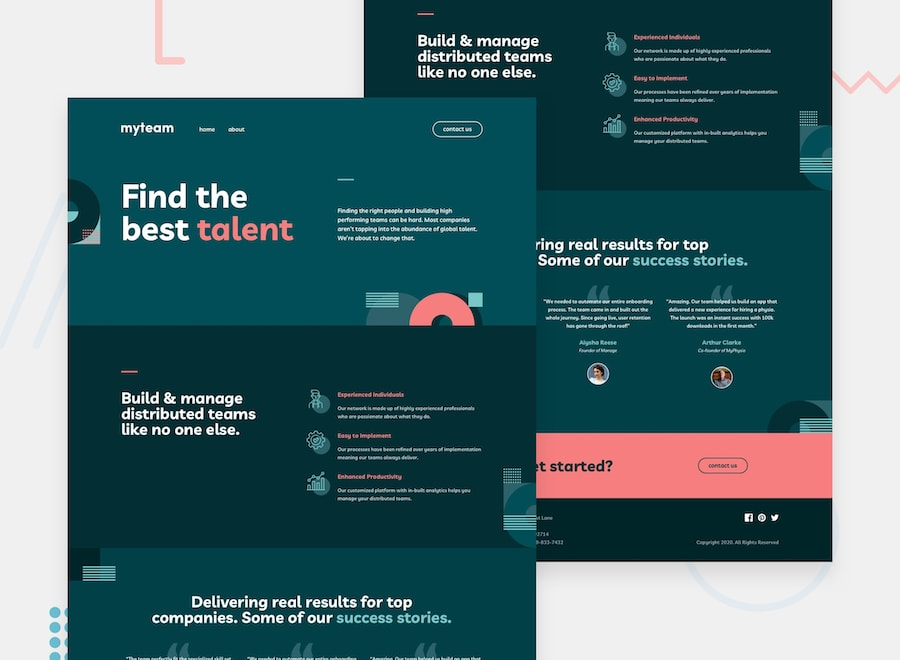

# Myteam Multipage 

 I am coding the design prepared by Frontend Mentor by adding animations. While developing this project, I use HTML, SCSS and Javascript technologies.

 ### Todo list
 * [x] Home page 
 * [x] About page
 * [x] Contact page
 * [x] Page animations
